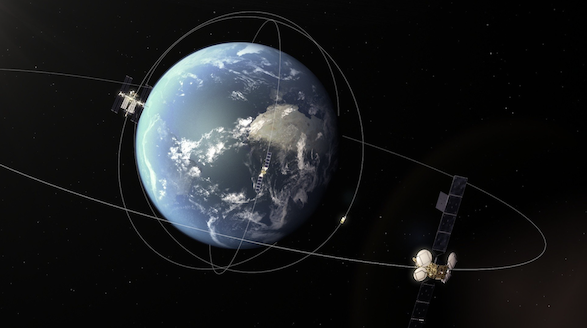
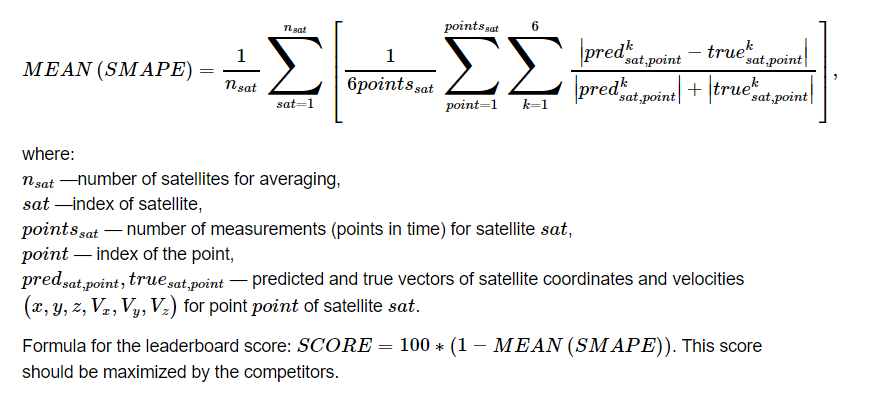
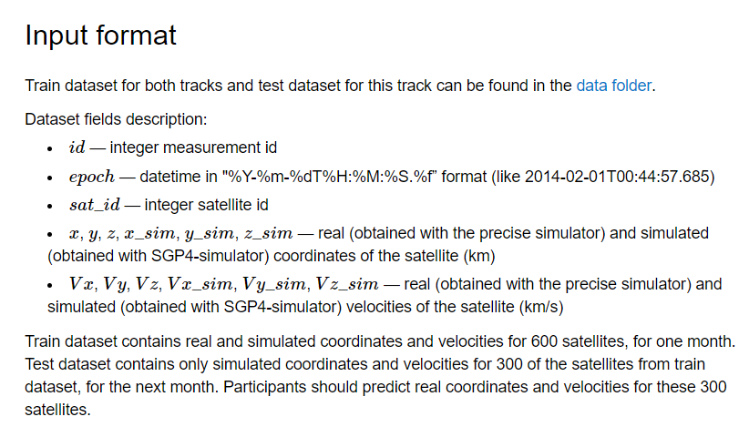
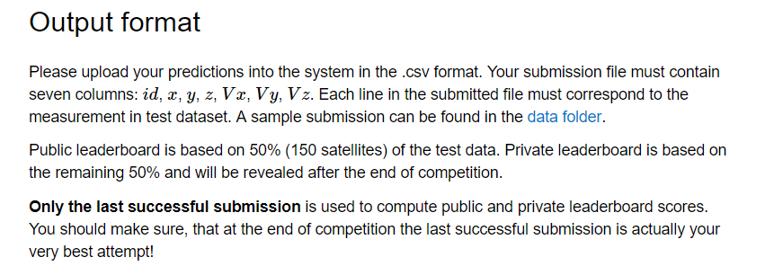

# IDAO 2020 Track 1
## __Objective.__

Build a model that would predict the position of space objects using simulation data.



## Background information.

Predicting the position of satellites is one of the most important tasks in astronomy. For example, information on the exact position of satellites in orbit is necessary to avoid extremely dangerous satellite collisions. Each collision leads not only to satellites destruction, but also results in thousands of space debris pieces. For instance, Iridium-Coscos collision in 2009 increased number of space debris by approximately 13%. Further collisions may result in Kessler syndrome and the inaccessibility of outer space. Also, a more accurate prediction of satellite position will help calculate more efficient maneuvers to save propellant and extend satellite life in orbit.


At the same time, it is difficult to predict the exact position of a space object, since the form and other parameters might be unknown. Furthermore, mathematical-physical models cannot fully take into account many factors, such as the Earth’s Surface Roughness and Solar pressure. One of the partners of the Olympiad and the author of the task is the Russian Astronomical Science Center (ASC). ASC is engaged in the creation and operation of automated optoelectronic systems for observing space objects and automated systems for processing information about space objects. This problem has special relevance to them. For example, maintaining the Catalog of Earth Satellite Orbits requires repeated observations of space objects. To do such observations, it is necessary to know where to target the telescopes.


IDAO participants are asked to clarify the prediction of a Simplified General Perturbations-4 (SGP4) model. SGP4 is able to predict a lot of effects but is applied to near-Earth objects with an orbital period of fewer than 225 minutes, while high orbit space objects have orbital periods up to 200 hours. For the true position of the satellites, the position obtained using a more accurate simulator will be taken. Subsequently, the obtained models will be applied to real classified data and will help to predict the positions of these space objects.

## Quality metric.

Predictions of satellites’ coordinates and velocities made by participants will be compared to the ground truth using SMAPE score.
More specifically, for a satellite and points in time, all the submitted predictions and true values are concatenated into 1-d arrays, then SMAPE is computed by the equivalent of the following code:
import Pygment

```python
def smape(satellite_predicted_values, satellite_true_values): 
    # the division, addition and subtraction are pointwise 
    return np.mean(np.abs((satellite_predicted_values - satellite_true_values) 
        / (np.abs(satellite_predicted_values) + np.abs(satellite_true_values))))
```
After that SMAPE is averaged over the satellites. Formula:





